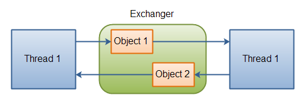

Exchanger
=========

Exchanger
=========

The `java.util.concurrent.Exchanger` class represents a kind of rendezvous point where two threads can exchange objects. Here is an illustration of this mechanism:

**Two threads exchanging objects via an Exchanger.**

Exchanging objects is done via one of the two `exchange()` methods. Here is an example:

Exchanger exchanger = new Exchanger();

ExchangerRunnable exchangerRunnable1 =
        new ExchangerRunnable(exchanger, "A");

ExchangerRunnable exchangerRunnable2 =
        new ExchangerRunnable(exchanger, "B");

new Thread(exchangerRunnable1).start();
new Thread(exchangerRunnable2).start();

Here is the `ExchangerRunnable` code:

public class ExchangerRunnable implements Runnable{

    Exchanger exchanger = null;
    Object    object    = null;

    public ExchangerRunnable(Exchanger exchanger, Object object) {
        this.exchanger = exchanger;
        this.object = object;
    }

    public void run() {
        try {
            Object previous = this.object;

            this.object = this.exchanger.exchange(this.object);

            System.out.println(
                    Thread.currentThread().getName() +
                    " exchanged " + previous + " for " + this.object
            );
        } catch (InterruptedException e) {
            e.printStackTrace();
        }
    }
}

This example prints out this:

Thread-0 exchanged A for B
Thread-1 exchanged B for A

